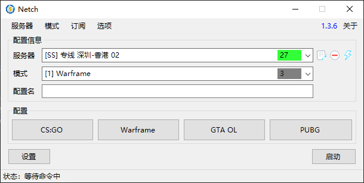

# 主页
> 游戏加速工具

## 介绍
Netch 是一款 Windows 平台的开源游戏加速工具，Netch 可以实现类似 SocksCap64 那样的进程代理，也可以实现 SSTap 那样的全局 TUN/TAP 代理，和 Shadowsocks-Windows 那样的本地 Socks5，HTTP 和系统代理。至于连接至远程服务器的代理协议，目前 Netch 支持以下代理协议：Socks5、Shadowsocks、ShadowsocksR、VMess

与此同时 Netch 避免了 SSTap 的 NAT 问题 ，检查 NAT 类型即可知道是否有 NAT 问题。使用 SSTap 加速部分 P2P 联机，对 NAT 类型有要求的游戏时，可能会因为 NAT 类型严格遇到无法加入联机，或者其他影响游戏体验的情况

## 赞助商

这是我所选择的服务器提供商，IPLC 专线翻墙、稳定、速度快、价格便宜。欢迎大家使用我的推广链接前去注册：[这里](https://across-gfw.com/register?aff=4739)

## 截图

## 依赖
- [Visual C++ 运行库合集](https://www.google.com/search?q=Visual+C%2B%2B+%E8%BF%90%E8%A1%8C%E5%BA%93%E5%90%88%E9%9B%86)
- [.NET Framework 4.8](https://dotnet.microsoft.com/download/dotnet-framework/thank-you/net48-offline-installer)
- [TAP-Windows](https://build.openvpn.net/downloads/releases/tap-windows-9.21.2.exe)
